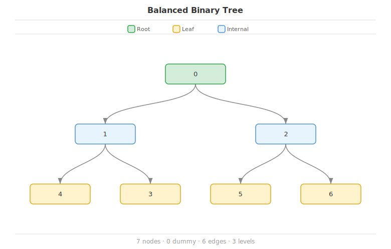
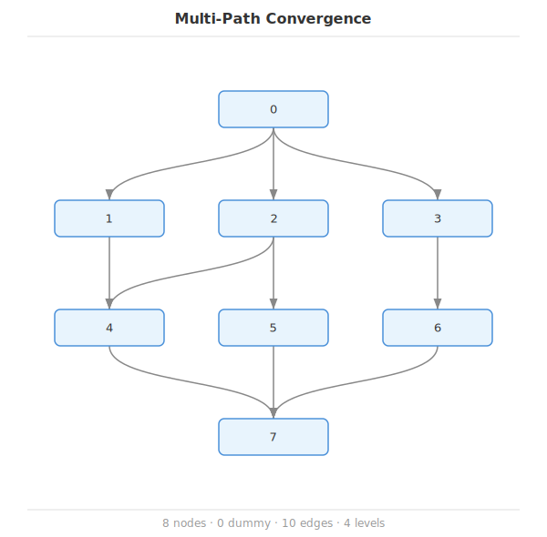
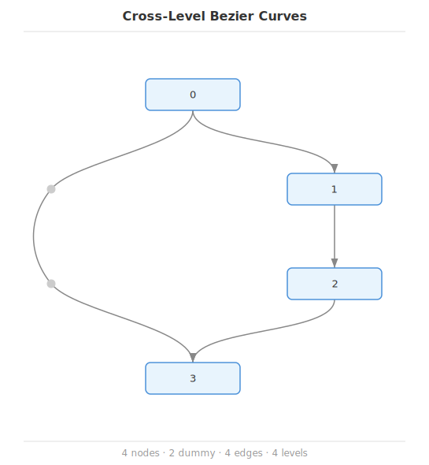
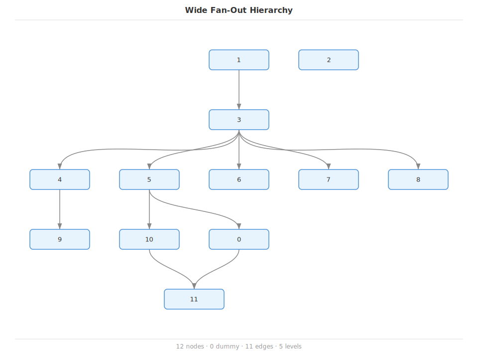
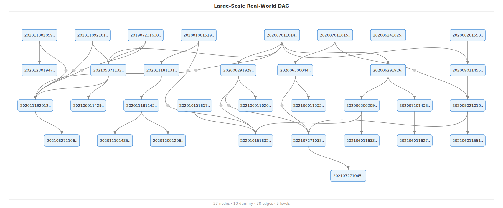

# sun-hierarchy

A library for hierarchy graph layout based on the Sugiyama framework.

## Examples

### Balanced Binary Tree — 3 levels, symmetric fan-out



### Multi-Path Convergence — multiple paths merging into a single sink



### Cross-Level Bezier Curves — long-span edges with dummy nodes



### Wide Fan-Out Hierarchy — 1-to-5 branching across 5 levels



### Large-Scale Real-World DAG — 33 nodes, 10 dummy nodes, 38 edges



## Install

```bash
npm i sun-hierarchy --save

yarn add sun-hierarchy --save
```

## Intro

This library is based on the Sugiyama framework. There are 4 steps to handle the input graph:

1. Divide the input graph into separate isolated sub-graphs
2. Use longest path to determine hierarchy of each graph
3. Reduce crossings by heuristic barycentric method
4. Position vertices of each level with the algorithm: "Fast and Simple Horizontal Coordinate Assignment"

## Usage

### Layout

```typescript
import layout, { Graph, Vertex, Edge, LayoutOptions } from 'sun-hierarchy';

const options: LayoutOptions = {
  // node width
  width: 150,
  // node height
  height: 50,
  // node margin
  margin: { left: 0, right: 0, top: 0, bottom: 0 },
  // barycentric iteration round number, default 12  
  barycentricOptions: { totalRound: 10 }
};

const vertices: Vertex[] = [];
for (let i = 0; i < 10; i++) {
  vertices.push(new Vertex(i));
}
const edges: Edge[] = [];
edges.push(new Edge(vertices[1], vertices[4]));
edges.push(new Edge(vertices[1], vertices[5]));
edges.push(new Edge(vertices[4], vertices[3]));
edges.push(new Edge(vertices[5], vertices[2]));
edges.push(new Edge(vertices[6], vertices[2]));
edges.push(new Edge(vertices[7], vertices[3]));
edges.push(new Edge(vertices[7], vertices[9]));
edges.push(new Edge(vertices[8], vertices[5]));

const g: Graph = new Graph(vertices.slice(1), edges, { directed: true });
const graphs: Graph[] = layout(g, options);
```

### Edge Routing

After layout, use `routeEdges` to generate connection paths between nodes. The library provides built-in **Bezier curve** and **orthogonal polyline** generators, and also supports custom path generators.

```typescript
import { routeEdges } from 'sun-hierarchy';

// Default: bezier curves
const paths = routeEdges(levels, {
  nodeWidth: 150,
  nodeHeight: 50,
});

// Orthogonal polylines
const paths = routeEdges(levels, {
  pathGenerator: 'orthogonal',
});

// Custom path generator
const paths = routeEdges(levels, {
  pathGenerator: (points) => {
    // points: array of {x, y} waypoints
    // return { svgPath: string, commands: PathCommand[] }
  },
});

// Each path contains:
paths.forEach(({ sourceId, targetId, svgPath, points, commands }) => {
  // sourceId / targetId — real node IDs (dummy nodes are merged)
  // svgPath — ready-to-use SVG path string, e.g. "M 100 50 C ..."
  // points — waypoint coordinates
  // commands — structured path commands (M, L, C)
});
```
